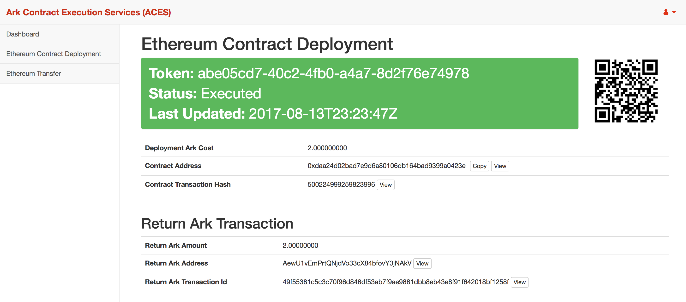

# ACES Frontend Application

The Ark Contract Execution Service (ACES) App allows users to execute service contracts (such as Ethereum
contracts) by sending a payment transaction using the [Ark Wallet](https://github.com/ArkEcosystem/ark-desktop).

This respository is the frontend UI application for ACES nodes.

## Screenshots



## Development Stack

- [Angular 4 Framework](https://angular.io/)
- [Bootstrap 3](http://getbootstrap.com/)
- [Bootstrap 3 SB Admin 2 Theme](https://blackrockdigital.github.io/startbootstrap-sb-admin-2/)

## Running Application

To run the application run the following npm commands:

```
npm install
npm start
```

View the application in a web browser at: [http://localhost:4200/](http://localhost:4200/)

Have fun! 
